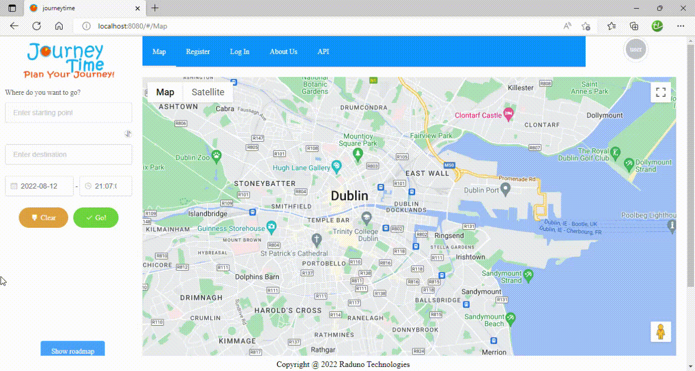

# COMP47360_Group3_Raduno - Journey Prediction For Bus Services In Dublin

This project is twofold:
- a bus journey prediction RESTful api for developers to access a prediction service allowing easy
prediction service integration into new web applications
- a lightweight web application for Bus users in the Dublin region to conveniently plan their trips.
The project was completed as part of module 'COMP47360' in University College Dublin (the Research
Practicum) and is submitted on behalf of Team 3, "Raduno"

We trained both our Random Forest and Linear Regression models on Dublin Bus data from 2018. Two classes
of models were produced:
- one for each Dublin Bus "real-world route name" (e.g. 'the number 15B') running at that time. This
model (our 'end-to-end' model set) is used to make journey time predictions for trips on those Dublin
Bus routes.
- one to cover all other routes (our 'stop-to-stop' model)
The second model is used to cover routes not available in the 2018 dataset. The distances for these
routes are estimated using the shapes provided by the Google Directsion service. A stop-by-stop
breakdown of the route is obtained from the GTFS data set available from the NTA. The distance of
each stop from the city center is used as a congestion metric along with the segment length to
produce a transit time prediction.

The JourneyTime Prediction API can be viewed [here](https://api.journeyti.me/).
The JourneyTime journey planning app. can be viewed [here](https://journeyti.me/).

## Features

### Plan Your Journey

We display a selection of bus routes between any two locations connected by Bus Services in Dublin.



### Travel Time Predictions

We display travel times predictions transparently made using the most suitable model and broken down in stop by stop detail


## Technologies

- api.JourneyTi.me
  - Apache Webserver
  - Flask 2.1.2
  - Python
  - Bootstrap v5
  - HTML, Javascript & CSS
  - MySQL
  - Selenium
- JourneyTi.me
  - AWS EC2 Instance
  - Nginx Webserver
  - VUE.js
  - HTML, Javascript & CSS
- Data Analysis
  - Jupyter Notebooks (pandas, numpy, scipy, sklearn)

## Production

We use (Ubuntu) container provided by UCD as our main production environment (the api.journeyti.me
server) and an AWS EC2 instance as the container for our lightweight journey planning application.
Deployment of the JourneyTime API software is via pip install from this GitLab repository.
Deployment of the Journey Planning application remains manual at this time.

Our Random Forest models are stored solely on the container provided by UCD. Running the JourneyTime
API server that provides the prediction service will not use our predictive models.

## Installation

### Journeytime API Server

1. Installing the JourneyTi.me server is a relatively involved process and requires access to a
Linux server for scheduled task support

- Detailed instructions on the process are available [here](Installing_jtApi-VM_Environment_&_Configuration.rtf)
as a .rtf file (download to view)

2. The application requires a complete and properly formatted 'journeytime.json' file to control
server behaviour.  A sample configuration file is available [here](README_journeytime_config)

### Frontend
???
## Running the Flask app locally

To run the api.JourneyTi.me app locally you need to connect to the development MySQL database. It is
sufficient to have access to an empty database (i.e. one with the appropriate tables configured but
no data) before an initial load of GTFS data. A dump of the database structure an be found [here](api_journeytime_db.sql)

3. Once your MySQL instance is up and running - and you have updated your configuration journeytime.json
with the relevant details you're almost set.

4. Change directory to the jtApi directory and (with your conda virtual environment activated) run
the following command:

```
python jt_flask_module.py
```

Open http://127.0.0.1/ and you should see the app running.
